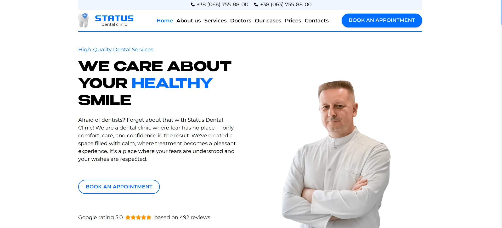
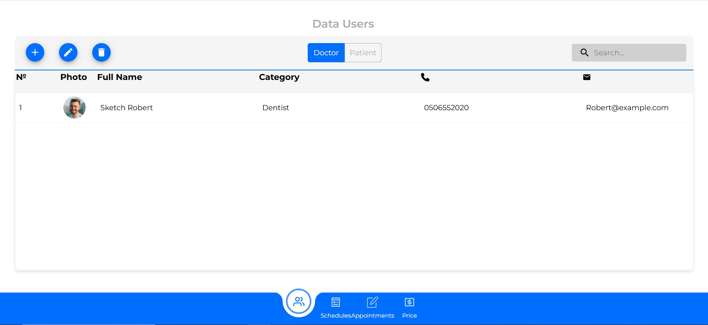

# 🦷 Status Dental Clinic

Веб-додаток для стоматологічної клініки з онлайн-записом, адмініструванням та SEO-оптимізацією.

## 🚀 Технології
- Next.js, React, Tailwind CSS, MUI
- Prisma, PostgreSQL, Supabase Storage
- Google Maps API, Search Console
- SEO: metadata, jsonLD, sitemap

## ⚙️ Функціонал
- Онлайн-запис на прийом з повідомленням у Telegram адміністратора
- Панель адміністратора на 4 сторінки:
    1.База даних лікарів та пацієнтів з CRUD-операціями, фільтром та пошуком
    2.Створення робочих графіків для лікарів з прив'язкою до онлайн запису та CRUD-операціями
    3.База даних записів на прийом з CRUD-операціями, фільтром та пошуком
    4.Прайс - створення карток сервісу з додаванням послуг та вартості
- Інтеграція з Google Maps
- SEO-оптимізація для пошукових систем

## 📦 Деплой
Розгорнуто на [Vercel](https://vercel.com)

## 📸 Скриншоти
### Головна сторінка

### Панель адміністратора

## 👨‍💻 Роль у проєкті
Самостійна розробка повного циклу:
- Розробка дизайну (Figma)
- Архітектура та структура проєкту
- Реалізація функціоналу
- SEO та інтеграції
- Продакшн-деплой

## 📬 Контакти
- [LinkedIn](# В процесі заповнення профілю)
- [Email](mailto:chichkoff@gmail.com)
- Телефон: [+380962040986](tel:+380962040986)
- WhatsApp: [Написати](https://wa.me/380962040986)
- Telegram: [@Gelotrop](https://t.me/Gelotrop)
- Viber: [Написати](viber://chat?number=+380962040986)
